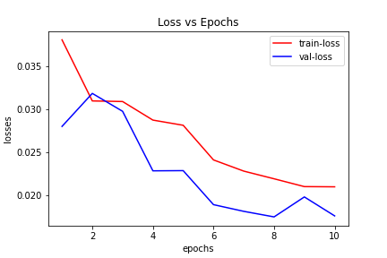
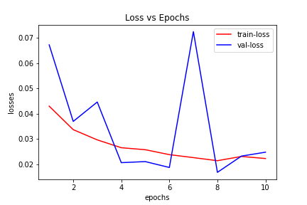
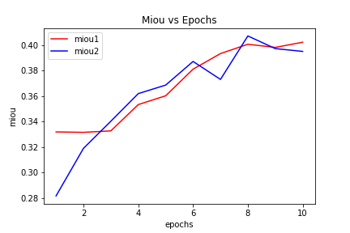

# DSRL
> @authors: Satwik Srivastava (M21MA006), Misaal Khan (D20ID004), Pulkit Garg (P21CS011) 

## NOTES
- Link to the [Dataset](https://www.kaggle.com/datasets/kumaresanmanickavelu/lyft-udacity-challenge) (*Store in data/lyft* **or** *change file paths in `config.py`*)
- Link to [Drive](https://drive.google.com/drive/folders/1AYqUHkCzqU-mEiEwvsqCs3EfeBgJFeXw?usp=sharing) Folder
- Link to original authors github repository(*ies*). [original](https://github.com/Xilinx/DSRL), [fork](https://github.com/Dootmaan/DSRL)
	- Clone the REPO from [fork]((https://github.com/Dootmaan/DSRL) and place it in your project folder.
- Run the `test.ipynb` notebook to see the model train. `models/` folder contains the trained models load them to inference.

## Results

 - The loss plot and miou plots are represented below.
 - Loss-Plot for `model-1`
 

 - Loss-Plot for model with proposed changes.
 

 - MIOU
 

## References
> L. Wang, D. Li, Y. Zhu, L. Tian and Y. Shan, "Dual Super-Resolution Learning for Semantic Segmentation," 2020 IEEE/CVF 
Conference on Computer Vision and Pattern Recognition (CVPR), 2020, pp. 3773-3782, doi: 10.1109/CVPR42600.2020.00383.
